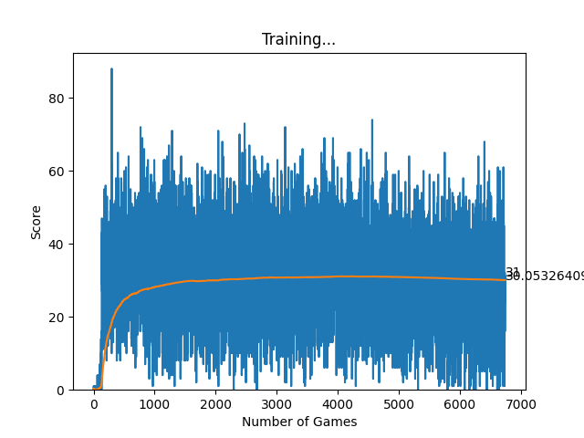

# Snake : Reinforcement Learning

This personal project was intended to help me become familiar with reinforcement learning algorithms and the associated Python libraries. I used pygame for the interface and pytorch for the algortihms


## How to run

To play a game of snake yourself (WASD) :
```console
$ python snake.py
```
To run the agent :
```console
$ python agent.py
```

## Visualization

Visualization of the training curve of the agent :



